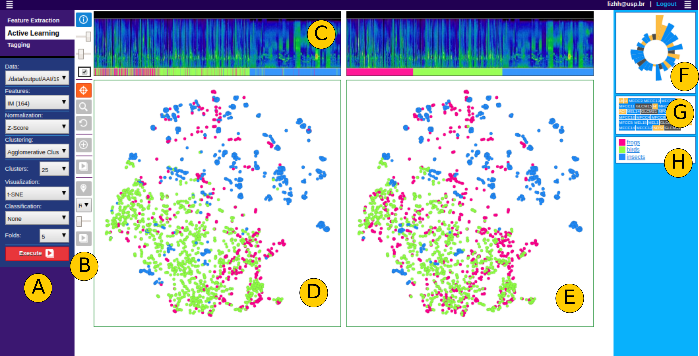

# Visual Active Learning for Labeling - SoundscapeX
This is a method of user-centered active learning that aims to optimize and give more dynamism to the entire process of labeling, by including visual strategies in the several stages of active learning. The methodology is explained in the article "Visual Active Learning for Labeling: A Case for Soundscape Ecology Data" that is available at [Information Journal](https://www.mdpi.com/2078-2489/12/7/265).

## Authors
Liz Huancapaza Hilasaca, Milton Cezar Ribeiro and Rosane Minghim.

# SoundscapeX

Framework - SoundscapeX is a tool to support labeling in soundscape ecology data. The figure shows the screenshot of the main interface of the Framework. (A) Initially, a configuration parameter panel. (B) Allows interact and explore the data within the projection in region D. (C) TLS is coordinated with the projection’s data, allowing exploration interactive. (D) Multiple visualizations of the active learning process. (E) The ground truth. (F) Polar histogram of features. (G) Features used in the experiment. (H) Legend of labels in the data set.

 

 

## Citation
<pre><code>
@Article{lizhh2021vis,
AUTHOR = {Hilasaca, Liz Huancapaza and Ribeiro, Milton Cezar and Minghim, Rosane},
TITLE = {Visual Active Learning for Labeling: A Case for Soundscape Ecology Data},
JOURNAL = {Information},
VOLUME = {12},
YEAR = {2021},
NUMBER = {7},
ARTICLE-NUMBER = {265},
URL = {https://www.mdpi.com/2078-2489/12/7/265},
ISSN = {2078-2489},
ABSTRACT = {Labeling of samples is a recurrent and time-consuming task in data analysis and machine
learning and yet generally overlooked in terms of visual analytics approaches to improve the process. 
As the number of tailored applications of learning models increases, it is crucial that more effective 
approaches to labeling are developed. In this paper, we report the development of a methodology and a 
framework to support labeling, with an application case as background. The methodology performs visual 
active learning and label propagation with 2D embeddings as layouts to achieve faster and interactive 
labeling of samples. The framework is realized through SoundscapeX, a tool to support labeling in 
soundscape ecology data. We have applied the framework to a set of audio recordings collected for a 
Long Term Ecological Research Project in the Cantareira-Mantiqueira Corridor (LTER CCM), localized in 
the transition between northeastern São Paulo state and southern Minas Gerais state in Brazil. We 
employed a pre-label data set of groups of animals to test the efficacy of the approach. The results 
showed the best accuracy at 94.58% in the prediction of labeling for birds and insects; and 91.09% for 
the prediction of the sound event as frogs and insects.},
DOI = {10.3390/info12070265}
}
}</code></pre>

### Contact

+ Liz Maribel Huancapaza Hilasa <lizhh@usp.br>
+ Milton Cezar Ribeiro <mcr@rc.unesp.br>
+ Rosane Minghim <rosane.minghim@ucc.ie>  

